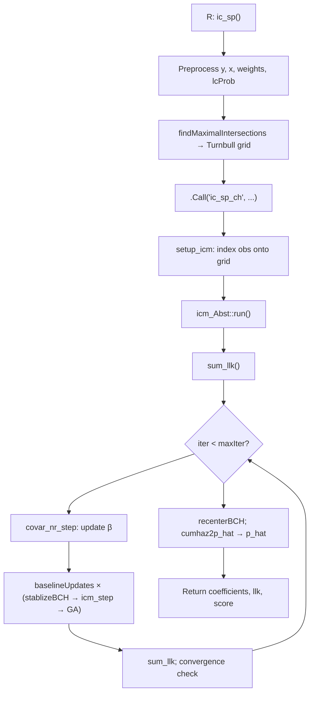

# ic_sp: Estimating Regression Parameters for Cox PH Models

This document walks through how `ic_sp()` estimates regression coefficients β for a **Cox proportional hazards (PH)** semi-parametric model with interval-censored data. It follows the code path from the R entry point into the C++ optimizer, with emphasis on the **conditional Newton–Raphson step for β** and how it fits into the larger alternating scheme.

For the mathematical notation and mixture-likelihood (`lcProb`) extensions, see [`.cursor/plans/ic_sp_mixture_likelihood_ec7e03c7.plan.md`](../.cursor/plans/ic_sp_mixture_likelihood_ec7e03c7.plan.md).

---

## High-level picture

`ic_sp` maximizes a weighted log-likelihood

\[
\mathcal{L}(\beta, \Lambda) = \sum_i w_i \log(\text{pob}_i)
\]

where:

- \(\eta_i = x_i^\top \beta\) (plus an internal intercept used for numerical stabilization on PH models)
- \(\Lambda\) is the baseline log cumulative hazard on Turnbull cutpoints
- \(\text{pob}_i\) is the probability that subject \(i\)'s event falls in their censoring interval, computed from conditional survival \(S(t \mid x_i)\)

For Cox PH (`model = "ph"`), conditional survival is

\[
S(t \mid x) = \exp\bigl(-\exp(\Lambda_t + \eta)\bigr)
\]

The optimizer alternates three kinds of updates each outer iteration:

1. **Regression (β)** — conditional Newton–Raphson
2. **Baseline cumulative hazard (Λ)** — ICM with PAVA
3. **Baseline probability masses (p)** — constrained gradient ascent (when `useGA = TRUE`, the default)



---

## Step 0 — R layer: data preparation

**Files:** `R/ic_sp.R`, `R/internal_utilities.R`

| Step | Function | What it does |
|------|----------|--------------|
| Parse formula | `make_xy()` | Builds `yMat` (interval endpoints) and design matrix `x` |
| Interval coding | `adjustIntervals(B, yMat)` | Opens/closes intervals per `B`; exact obs (`l ≈ u`) unchanged |
| Weights | `checkWeights()` | Case weights `w[i]` (bootstrap replication counts, not mixture weights) |
| Mixture weights | `checkLcProb()` | Optional per-subject `lcProb` (π); defaults to 0 except left-censored → 1 |
| Covariate centering | `icColMeans()` | Subtracts column means from `x` before fitting |
| Fit dispatch | `fit_ICPH()` | Builds Turnbull indices, calls C++ |

Control parameters come from `makeCtrls_icsp()`:

| Control | Default | Effect |
|---------|---------|--------|
| `useGA` | `TRUE` | Run constrained gradient ascent on baseline masses |
| `maxIter` | `10000` | Outer iteration cap |
| `baseUpdates` | `5` | ICM + GA repetitions per outer iteration |
| `updateReg` | `TRUE` | Whether to run the NR step for β |

```152:152:R/ic_sp.R
  fitInfo <- fit_ICPH(yMat, x, callText, weights, other_info)
```

For PH models, `callText = 'ic_ph'` and `fitType = 1` is passed to C++.

---

## Step 1 — Turnbull intervals and observation indexing

**Files:** `R/internal_utilities.R` (`findMaximalIntersections`), `src/icenReg_files/ic_sp_ch.cpp` (`findMI`)

`fit_ICPH()` calls `findMaximalIntersections(obsMat[,1], obsMat[,2])`, which:

1. Collects all unique interval endpoints
2. Calls C++ `findMI` to construct **maximal intersection (Turnbull) intervals**
3. Returns, for each subject:
   - `l_inds[i]` — index of the Turnbull interval containing \(L_i\)
   - `r_inds[i]` — index of the Turnbull interval containing \(R_i\)

These indices map each observation onto the discrete baseline grid. Endpoints of the grid are fixed at \(-\infty\) and \(+\infty\) in `baseCH`.

```255:272:R/ic_sp.R
  mi_info <- findMaximalIntersections(obsMat[,1], obsMat[,2])
  ...
  c_ans <- .Call('ic_sp_ch', mi_info$l_inds, mi_info$r_inds, 
                 covars, fitType, as.numeric(weights), useGA, 
                 as.integer(maxIter), as.integer(baselineUpdates),
                 as.logical(useFullHess), as.logical(updateCovars),
                 as.double(regStart), as.double(lcProb))
```

---

## Step 2 — C++ initialization (`setup_icm`)

**Files:** `src/icenReg_files/ic_sp_ch.cpp` (`setup_icm`), `src/icenReg_files/ic_sp_ch.h` (`icm_Abst`, `icm_ph`)

`ic_sp_ch()` constructs an `icm_ph` object (fitType = 1) and calls `setup_icm()`:

| Initialized quantity | Role |
|---------------------|------|
| `obs_inf[i].l`, `.r` | Turnbull interval indices for subject \(i\) |
| `node_inf[j].l`, `.r` | Reverse maps: which observations touch knot \(j\) on left/right |
| `baseCH[j]` | Log cumulative hazard at knot \(j\); ends fixed at ±Inf |
| `baseS[j]` | Baseline survival \(S_0(t_j) = \exp(-e^{\Lambda_j})\) |
| `reg_par` | Initial β from `controls$regStart` (default 0) |
| `covars` | Design matrix (Eigen) |
| `w`, `lcProb`, `hasLcMix` | Weights and mixture flags |

Initial baseline: `baseS` is a linearly decreasing sequence from 1 to 0, converted to `baseCH` via `baseS_2_baseCH()`.

The PH-specific survival link lives in `icm_ph`:

```169:172:src/icenReg_files/ic_sp_ch.h
    double basHaz2CondS(double ch, double eta){
        if(ch == R_NegInf)  return(1);
        if(ch == R_PosInf)  return(0);
        return(exp(-exp(ch + eta) )) ;}
```

---

## Step 3 — Likelihood evaluation (shared by all optimizers)

**Files:** `src/icenReg_files/ic_sp_ch.cpp`

Every optimization step ultimately depends on these functions:

### `update_p_ob(i)` — per-subject probability factor

Computes \(\text{pob}_i\) from baseline and \(\eta_i\):

```14:24:src/icenReg_files/ic_sp_ch.cpp
void icm_Abst::update_p_ob(int i){
    double chl = baseCH[ obs_inf[i].l ];
    double chr = baseCH[ obs_inf[i].r +1 ];
    double eta = etas[i];
    double likelihood_interval = basHaz2CondS(chl, eta) - basHaz2CondS(chr, eta);
    double pi = lcProb[i];
    obs_inf[i].pob = likelihood_interval;
    if(pi > 0.0 && pi <= 1.0){
        double likelihood_left = 1.0 - basHaz2CondS(chr, eta);
        obs_inf[i].pob = pi * likelihood_left + (1.0 - pi) * likelihood_interval;
    }
}
```

Standard case (\(\pi_i = 0\)): \(\text{pob}_i = S(L_i) - S(R_i)\).

### `update_etas()` — linear predictors

\(\eta_i = x_i^\top \beta + \text{intercept}\). Called after every β update.

### `sum_llk()` — full log-likelihood

Loops over subjects, calls `update_p_ob(i)`, accumulates \(w_i \log(\text{pob}_i)\).

### `par_llk(j)` — partial log-likelihood for knot \(j\)

Used by the ICM step: sums contributions from observations whose \(L\) or \(R\) boundary involves knot \(j\).

---

## Step 4 — Outer optimization loop (`run`)

**File:** `src/icenReg_files/ic_sp_ch.cpp` (`icm_Abst::run`)

```563:607:src/icenReg_files/ic_sp_ch.cpp
double icm_Abst::run(int maxIter, double tol, bool useGD, int baselineUpdates){
	...
	if(regNon0){
		if(hasCovars){stablizeBCH();}
		if(useGD){ gradientDescent_step();}
		icm_step();
		if(useGD){ gradientDescent_step();}		
		icm_step();
	}
	
    while(iter < maxIter && (llk_new - llk_old) > tol){
        iter++;
        llk_old = llk_new;
        if(hasCovars && updateCovars){ covar_nr_step(); }

        for(int i = 0; i < baselineUpdates; i++)  {
			if(hasCovars){stablizeBCH();}
            icm_step();
            if(useGD){ gradientDescent_step(); }
        }
			
	    llk_new = sum_llk();
	    ...
 	}
 	return(llk_new);
}
```

**Convergence:** stops when the log-likelihood increase between outer iterations is ≤ `tol` (= 10⁻¹⁰). A two-pass check (`metOnce`) avoids stopping on a single flat iteration.

**Warm-up:** if any β ≠ 0 at start, runs stabilize → GA → ICM → GA → ICM before the main loop.

**After convergence:** `recenterBCH()` shifts baseline and intercept; `cumhaz2p_hat()` converts `baseCH` to Turnbull probability masses `p_hat`.

---

## Step 5 — Regression update: conditional Newton–Raphson

This is the step that **directly estimates β**. It treats the current baseline as fixed and solves for a Newton step on the regression parameters.

**Files:** `src/icenReg_files/ic_sp_ch.cpp`

| Function | Role |
|----------|------|
| `covar_nr_step()` | Orchestrates NR: compute derivatives, solve, backtrack |
| `calcAnalyticRegDervs()` | Builds score `reg_d1` and Hessian `reg_d2` |
| `reg_d1_lnk`, `reg_d2_lnk` | PH-specific boundary contributions to \(\partial \log(\text{pob})/\partial \eta\) and \(\partial^2 \log(\text{pob})/\partial \eta^2\) (`icm_ph` in header) |
| `numericTotContOne()` | Numeric ∂log(pob)/∂η for PO interior π (PH uses analytic path below) |

### Derivatives (standard interval likelihood, π = 0)

For subject \(i\), treating baseline as fixed:

\[
\frac{\partial \ell_i}{\partial \eta_i} = w_i \cdot \underbrace{\frac{1}{\text{pob}_i}\left(\frac{\partial S_L}{\partial \eta_i} - \frac{\partial S_R}{\partial \eta_i}\right)}_{\text{totCont}_i}
\]

\[
\frac{\partial \mathcal{L}}{\partial \beta_a} = \sum_i w_i \cdot \text{totCont}_i \cdot x_{ia}
\]

#### From η to β

The equation for \(\partial \ell_i / \partial \eta_i\) (first equation in this section) does not involve covariates. The equation for \(\partial \mathcal{L}/\partial \beta_a\) (second equation) applies the chain rule, since \(\partial \eta_i / \partial \beta_a = x_{ia}\).

In vector form (where the transpose lives):

\[
\frac{\partial \mathcal{L}}{\partial \beta} = X^\top (w \odot \text{totCont})
\]

where \(X\) is the \(n \times p\) design matrix with rows \(x_i^\top\), and \(\odot\) is element-wise multiplication. The code aggregation matches the scalar sum:

```421:424:src/icenReg_files/ic_sp_ch.cpp
        for(int a = 0; a < k; a++){
            this_covar = covars(i,a);
            this_w_covar = this_w * this_covar;
            d1[a] += this_w_covar * this_totCont;
```

#### What is `log_p`?

In `calcAnalyticRegDervs`, after `update_p_ob(i)`:

```377:379:src/icenReg_files/ic_sp_ch.cpp
        update_p_ob(i);
        pob  = obs_inf[i].pob;
        log_p = log(pob);
```

So **`log_p = log(pob_i)`**. In the standard case (\(\pi_i = 0\)): `log_p = log(S_L - S_R)`.

`log_p` is passed into `reg_d1_lnk` / `reg_d2_lnk` because those functions implement derivatives of **\(\log(\text{pob})\)**, not of `pob` directly. The `exp(... - log_p)` pattern in `reg_d1_lnk` is equivalent to dividing by `pob`. The same `log_p` is used for both left and right boundary calls because it is the denominator for the full subject-level \(\partial \log(\text{pob}_i)/\partial \eta_i\).

#### Boundary contributions (first and second derivatives)

Because \(\text{pob}_i = S_L - S_R\), the log-derivative splits by boundary:

\[
\frac{\partial \log(\text{pob})}{\partial \eta}
= \frac{1}{\text{pob}}\frac{\partial S_L}{\partial \eta}
- \frac{1}{\text{pob}}\frac{\partial S_R}{\partial \eta}
\]

**First derivatives** (used for the score):

| Symbol | Meaning | Code |
|--------|---------|------|
| `l_cont` | \(\displaystyle\frac{1}{\text{pob}}\frac{\partial S_L}{\partial \eta}\) | `reg_d1_lnk(l_ch, eta, log_p)` |
| `r_cont` | \(\displaystyle\frac{-1}{\text{pob}}\frac{\partial S_R}{\partial \eta}\) | `-reg_d1_lnk(r_ch, eta, log_p)` |
| `totCont` | \(\partial \log(\text{pob})/\partial \eta\) | `l_cont + r_cont` |

**Second derivatives** (used for the Hessian). Newton–Raphson needs \(\partial^2 \log(\text{pob})/\partial \eta^2\). Using \(\frac{d^2}{d\eta^2}\log f = \frac{f''}{f} - \left(\frac{f'}{f}\right)^2\):

\[
\text{totCont2} = \underbrace{\frac{1}{\text{pob}}\frac{\partial^2 S_L}{\partial \eta^2}}_{\texttt{l\_cont2}}
+ \underbrace{\frac{-1}{\text{pob}}\frac{\partial^2 S_R}{\partial \eta^2}}_{\texttt{r\_cont2}}
- \text{totCont}^2
\]

| Symbol | Meaning | Code |
|--------|---------|------|
| `l_cont2` | \(\displaystyle\frac{1}{\text{pob}}\frac{\partial^2 S_L}{\partial \eta^2}\) | `reg_d2_lnk(l_ch, eta, log_p)` |
| `r_cont2` | \(\displaystyle\frac{-1}{\text{pob}}\frac{\partial^2 S_R}{\partial \eta^2}\) | `-reg_d2_lnk(r_ch, eta, log_p)` |
| `totCont2` | \(\partial^2 \log(\text{pob})/\partial \eta^2\) | `l_cont2 + r_cont2 - totCont²` |

`totCont` feeds the score (`reg_d1`); `totCont2` feeds the Hessian (`reg_d2`) via the covariate aggregation loop in `calcAnalyticRegDervs` (shown in the **From η to β** subsection above). For PH, `reg_d1_lnk` returns the full left-boundary contribution to \(\partial \log(\text{pob})/\partial \eta\) (not raw \(\partial S/\partial \eta\)).

#### When are left/right terms skipped?

```388:396:src/icenReg_files/ic_sp_ch.cpp
        else{
            if(l_ch > R_NegInf && !(hasLcMix && pi >= 1.0 - 1e-15)){
                l_cont[i]  = reg_d1_lnk(l_ch, eta, log_p);
                l_cont2[i] = reg_d2_lnk(l_ch, eta, log_p);
            }
            if(r_ch < R_PosInf){
                r_cont[i]  = -reg_d1_lnk(r_ch, eta, log_p);
                r_cont2[i] = -reg_d2_lnk(r_ch, eta, log_p);
            }
```

| Guard | Condition | Why skip |
|-------|-----------|----------|
| Left term | `l_ch > R_NegInf` | Left-censored obs have \(L = 0 \Rightarrow \Lambda_L = -\infty\), so \(S_L = 1\) and \(\partial S_L/\partial \eta = 0\). |
| Left term | `!(hasLcMix && pi >= 1.0 - 1e-15)` | When \(\pi_i \approx 1\), \(\text{pob} = 1 - S_R\) — \(S_L\) does not appear. Only the right boundary matters. |
| Right term | `r_ch < R_PosInf` | Right-censored obs have \(R = \infty \Rightarrow \Lambda_R = +\infty\), so \(S_R = 0\) and \(\partial S_R/\partial \eta = 0\). |

By observation type:

- **Interval-censored:** finite \(L\) and \(R\) → both `l_cont` and `r_cont` computed.
- **Left-censored:** `l_ch = -Inf` → skip left; only `r_cont`.
- **Right-censored:** `r_ch = +Inf` → skip right; only `l_cont`.
- **Exact (\(\pi=0\)):** both boundaries finite (same or adjacent knots) → both terms.
- **Mixture \(\pi \in (0,1)\):** PH uses weighted analytic `reg_d1_lnk_w` / `reg_d2_lnk_w`; PO still uses `numericTotContOne`.

**Quick summary:**

- Left boundary \(L\) (if finite and applicable): `l_cont = reg_d1_lnk(l_ch, eta, log_p)`; `l_cont2 = reg_d2_lnk(...)`
- Right boundary \(R\) (if finite): `r_cont = -reg_d1_lnk(r_ch, eta, log_p)`; `r_cont2 = -reg_d2_lnk(...)`
- `totCont = l_cont + r_cont`; `totCont2 = l_cont2 + r_cont2 - totCont²`

### NR solve and backtracking

```439:478:src/icenReg_files/ic_sp_ch.cpp
void icm_Abst::covar_nr_step(){
    ...
    calcAnalyticRegDervs(reg_d2, reg_d1);
    ...
    if(useFullHess){
      propVec = -reg_d2.fullPivLu().solve(reg_d1);
      ...
    }
    else{for(int i = 0; i < k; i++){propVec[i] = -reg_d1[i]/reg_d2(i,i);}}
    ...
    reg_par += propVec;
    ...
    while(lk_new < lk_0 && tries < 10){
        tries++;
        propVec *= 0.5;
        reg_par += propVec;
        update_etas();
        lk_new = sum_llk();
    }
}
```

- **`useFullHess = TRUE`** (default in `ic_sp`): full Hessian via `fullPivLu().solve()`; falls back to diagonal if solve is ill-conditioned
- **Backtracking:** halves the step up to 10 times until log-likelihood increases
- **`updateCovars = FALSE`:** skips this step (used for warm-start / fixed-β scenarios)

### Mixture likelihood (`hasLcMix`)

When any \(0 < \pi_i \le 1\):

- **Interior π on PH (`0 < \pi_i < 1`):** weighted analytic boundary assembly via `reg_d1_lnk_w` / `reg_d2_lnk_w`:

\[
\text{totCont}_i = \frac{(1-\pi_i)\,S_L' - S_R'}{L_i}, \qquad
\text{totCont2}_i = \frac{(1-\pi_i)\,S_L'' - S_R''}{L_i} - \text{totCont}_i^2
\]

Left boundary (if `l_ch > R_NegInf`): `reg_d1_lnk_w(l_ch, eta, log_p, log(1-π))`. Right boundary (if `r_ch < R_PosInf`): `-reg_d1_lnk_w(r_ch, eta, log_p, 0)`.

- **Interior π on PO:** `numericTotContOne()` finite-differences \(\log(\text{pob})\) w.r.t. \(\eta_i\) (unchanged).
- **π = 1 or π = 0:** analytic path via `reg_d1_lnk` at the appropriate boundaries (unchanged).

---

## Step 6 — Baseline ICM update

**Files:** `src/icenReg_files/ic_sp_ch.cpp` (`icm_step`, `numericBaseDervsOne`), `src/icenReg_files/basicUtilities.cpp` (`pavaForOptim`)

Updates free baseline log cumulative hazards \(\Lambda_j = \texttt{baseCH}[j]\), \(j = 1,\ldots,K\).

| Sub-step | Function | What it does |
|----------|----------|--------------|
| Numeric derivatives | `numericBaseDervsAllRaw` → `numericBaseDervsOne` | For each knot \(j\), finite-difference \(\partial \mathcal{L}_j / \partial \Lambda_j\) and \(\partial^2 \mathcal{L}_j / \partial \Lambda_j^2\) via `par_llk(j)` |
| Isotonic proposal | `pavaForOptim(d1, d2, x, prop)` | Pool-adjacent-violators update enforcing monotone non-decreasing \(\Lambda\) |
| Apply + enforce | `icm_addPar(prop)`; `checkCH()` | Add proposal; clamp so \(\Lambda_j \ge \Lambda_{j-1}\) |
| Line search | loop in `icm_step` | Halve step up to 5 times if likelihood decreases; revert if still worse |

Because derivatives are computed numerically through `par_llk` → `update_p_ob`, the ICM step automatically picks up mixture-likelihood changes without separate analytic formulas.

---

## Step 7 — Constrained gradient ascent on baseline masses

**Files:** `src/icenReg_files/ic_sp_gradDescent.cpp`

Used when `useGA = TRUE` (default). Especially important when many **exact** (uncensored) observations are present — analogous to how EM accelerates Turnbull NPMLE, but here the M-step has no closed form for semi-parametric regression.

| Sub-step | Function | What it does |
|----------|----------|--------------|
| Reparameterize | `baseCH_2_baseS` → `baseS_2_baseP` | Convert cumulative hazard to interval probability masses `baseP[j]` |
| Per-obs derivatives | `numeric_dobs_dp(forGA=true)` | Numeric \(\partial \log(\text{pob}_i)/\partial p_j\) by perturbing `baseS` at boundaries |
| Aggregate | loop over `node_inf` | Sum into `base_p_derv[j]` |
| Constrained direction | `gradientDescent_step` | Center derivatives (sum to 0), unit-normalize, respect \(p_j \in (0,1)\) via `getMaxScaleSize` |
| Line search | `llk_from_p()` | `baseP → baseS → baseCH → sum_llk()`; backtrack if needed |

When `hasLcMix`, `numeric_dobs_dp` routes through `cal_log_obs_mix()` instead of `log(s_l - s_r)`.

**Note:** `EM_step()` exists in the same file but is **not called** from `run()`. The production path uses gradient ascent, not EM.

---

## Step 8 — Numerical stabilization (`stablizeBCH`)

**File:** `src/icenReg_files/ic_sp_ch.h` (`icm_ph::stablizeBCH`)

PH-only. Before each baseline update block when covariates are present:

- Shifts the last finite baseline value toward a target
- Absorbs the shift into `intercept` and adjusts all `baseCH[j]`
- Calls `update_etas()`

This keeps baseline values in a numerically safe range without changing the fitted conditional survival. PO models use a no-op `stablizeBCH()`.

---

## Optimization steps — summary table

| Step | Algorithm | Parameters updated | Key files | Key functions | Analytic or numeric? |
|------|-----------|-------------------|-----------|---------------|---------------------|
| **Regression NR** | Conditional Newton–Raphson | β (`reg_par`) | `ic_sp_ch.cpp`, `ic_sp_ch.h` | `covar_nr_step`, `calcAnalyticRegDervs`, `reg_d1_lnk`, `reg_d2_lnk`, `reg_d1_lnk_w`, `reg_d2_lnk_w`, `numericTotContOne` | Analytic for standard / π∈{0,1}; PH interior π analytic; PO interior π numeric |
| **Baseline ICM** | Iterative Convex Minorant + PAVA | Λ (`baseCH[j]`) | `ic_sp_ch.cpp`, `basicUtilities.cpp` | `icm_step`, `numericBaseDervsOne`, `par_llk`, `pavaForOptim`, `checkCH` | Numeric derivatives of partial log-likelihood |
| **Baseline GA** | Constrained gradient ascent | p (`baseP[j]`) | `ic_sp_gradDescent.cpp` | `gradientDescent_step`, `numeric_dobs_dp`, `cal_log_obs` / `cal_log_obs_mix`, `llk_from_p`, `getMaxScaleSize` | Numeric derivatives w.r.t. masses |
| **Stabilization** | Baseline recentering (not an optimizer) | Λ + intercept | `ic_sp_ch.h` | `icm_ph::stablizeBCH`, `update_etas` | Deterministic shift |
| **Post-fit recenter** | Coefficient/baseline split | intercept, `baseCH` | `ic_sp_ch.cpp` | `recenterBCH` | Applied once after `run()` |
| **EM (unused in main loop)** | EM-like mass update | `baseP` | `ic_sp_gradDescent.cpp` | `EM_step` | Present but not invoked by `run()` |

---

## Outer iteration order (one pass)

When covariates are present and defaults are used:

```
1. covar_nr_step()           ← updates β
2. repeat baseUpdates times:
     stablizeBCH()            ← PH stabilization
     icm_step()               ← updates Λ
     gradientDescent_step()   ← updates baseP (if useGA)
3. sum_llk()                 ← check convergence
```

Regression parameters are updated **once** per outer iteration; baseline parameters get **`baseUpdates`** (default 5) ICM+GA cycles.

---

## Return path to R

**File:** `src/icenReg_files/ic_sp_ch.cpp` (`ic_sp_ch`)

After `run()`:

1. `recenterBCH()` — final intercept/baseline split
2. `cumhaz2p_hat(baseCH, p_hat)` — Turnbull interval masses
3. Returns list: `p_hat`, `coefficients`, `llk`, `iterations`, `score` (final `reg_d1`)

`fit_ICPH()` normalizes `p_hat` to sum to 1 and wraps in an `ic_ph` S3 object.

Bootstrap standard errors (optional) re-call `fit_ICPH()` on resampled data via `bs_sampleData` → `getBS_coef`; they do not change the point-estimation algorithm above.

---

## Code navigation cheat sheet

| Question | Where to look |
|----------|---------------|
| User-facing API and controls | `R/ic_sp.R`, `makeCtrls_icsp()` |
| Turnbull interval construction | `R/internal_utilities.R` → `findMaximalIntersections`; C++ `findMI` |
| R → C++ bridge | `fit_ICPH()` → `.Call('ic_sp_ch', ...)` |
| PH survival formula | `icm_ph::basHaz2CondS` in `ic_sp_ch.h` |
| Likelihood per subject | `update_p_ob`, `sum_llk` in `ic_sp_ch.cpp` |
| Main loop | `icm_Abst::run` in `ic_sp_ch.cpp` |
| **β update (your main interest)** | `covar_nr_step` → `calcAnalyticRegDervs` |
| Baseline Λ update | `icm_step` |
| Baseline p update | `gradientDescent_step` in `ic_sp_gradDescent.cpp` |
| `.Call` registration | `src/registeringRoutines.c` |

---

## References in the package

- Pan (1999) — extended ICM for Cox models with interval censoring (algorithm inspiration)
- `ic_sp` roxygen in `R/ic_sp.R` — describes conditional NR + ICM + gradient ascent design
- Mixture likelihood plan — full derivative formulas and `lcProb` semantics
